# eUpis

A full-stack admission management system focused on the master enrollment process.

The project supports the complete operational flow:

- candidate management,
- application submission and review,
- competition (Konkurs) setup,
- ranking generation,
- enrollment finalization.

It is designed around role-based workflows for **admin** and **student** users.

## What We Built

### Admin side

- Manage candidates (`/kandidati`) and candidate details.
- Review all applications (`/prijave`) with filtering, sorting, and status updates.
- Open and manage competitions (`/konkurs`):
  - create competition headers,
  - attach study programs and seat quotas,
  - change competition status.
- Run ranking and finalization workflows:
  - enter exam points,
  - generate final ranking lists,
  - confirm enrollment finalization.
- Access ranking list overviews and details (`/ranking-lists`).

### Student side

- Authenticate and access personal enrollment flow.
- Submit an application when no active application exists.
- Track existing application status.
- Upload/download required documents (where applicable in workflow).
- Continue to enrollment steps when approved.

## Application Walkthrough (Screenshots)

The screenshots below follow the typical usage flow of the app, from authentication and student submission to admin processing, ranking, and enrollment finalization.

### 1. Authentication

Login screen:

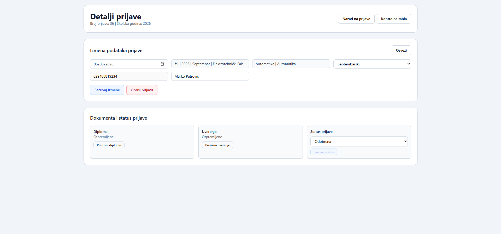

Registration screen:

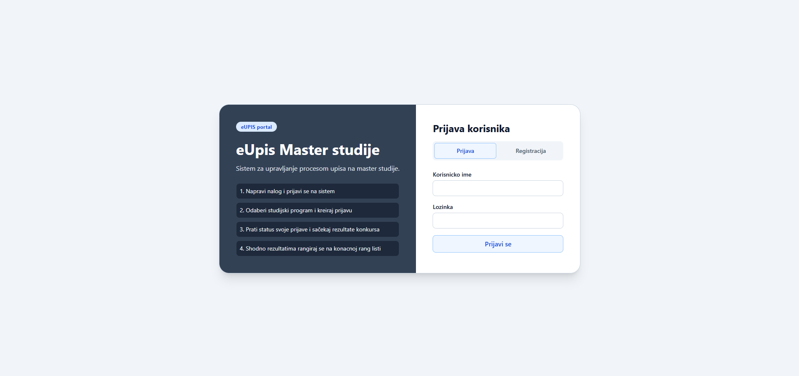

### 2. Student Application Flow

Step 1 - candidate data:

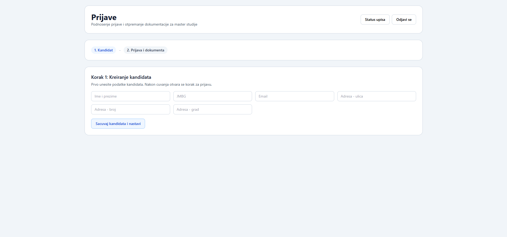

Step 2 - application data and document upload:

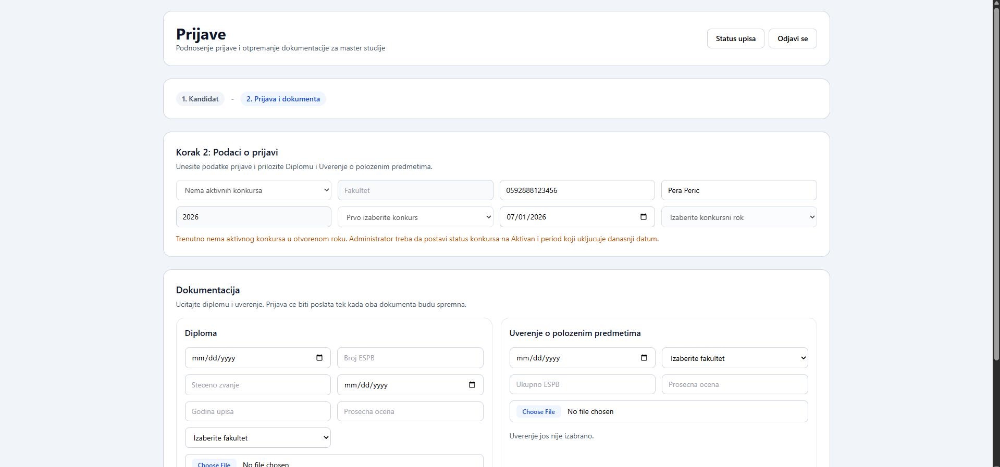

Submitted application status:

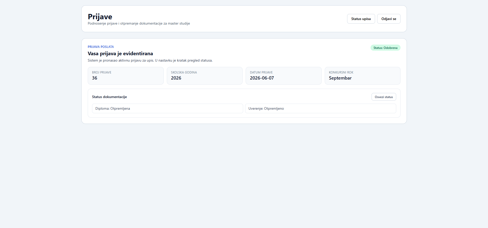

### 3. Admin Dashboard and Core Modules

Admin dashboard:

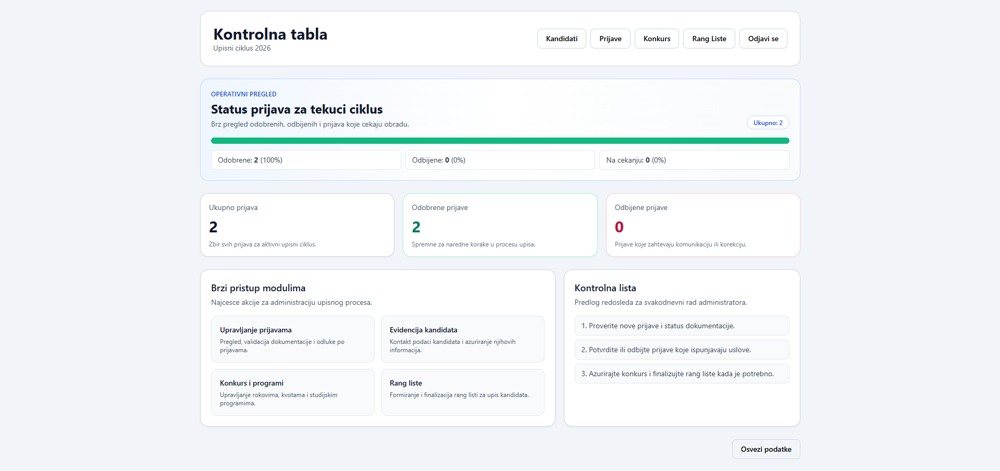

Candidate management:

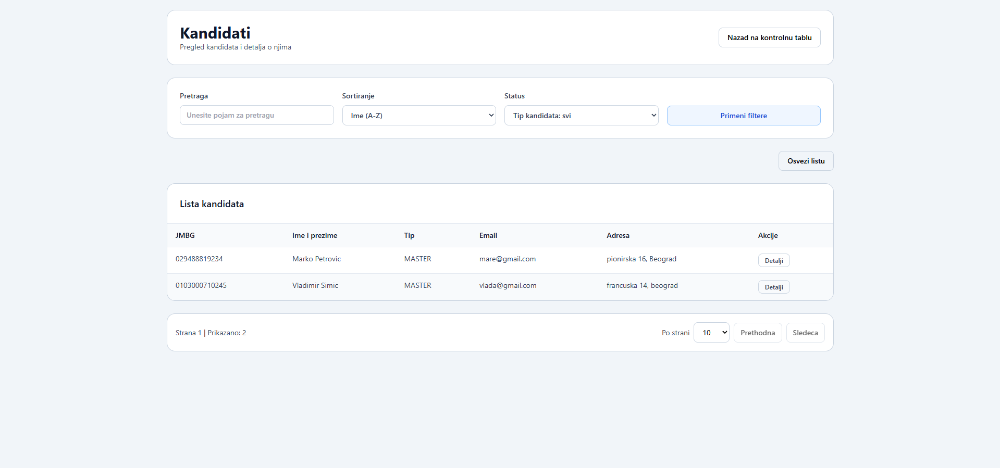

Application management:

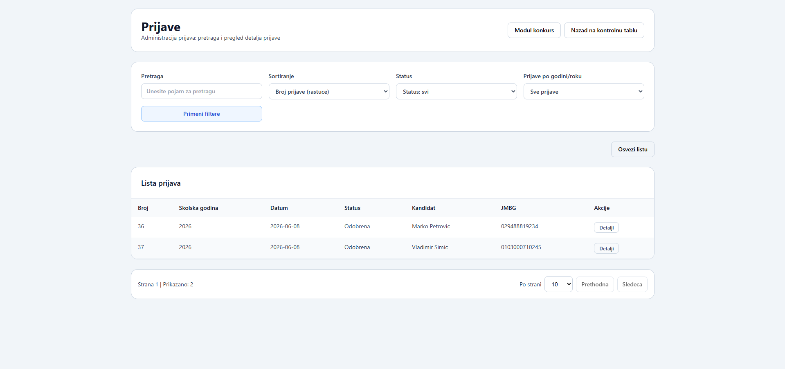

### 4. Competition and Ranking Workflow

Competition management:

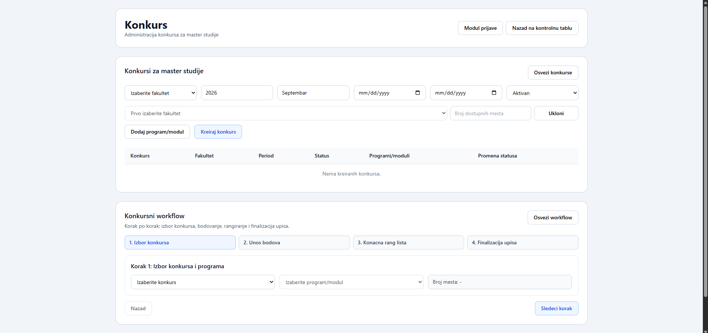

Competition workflow (points, ranking, finalization steps):

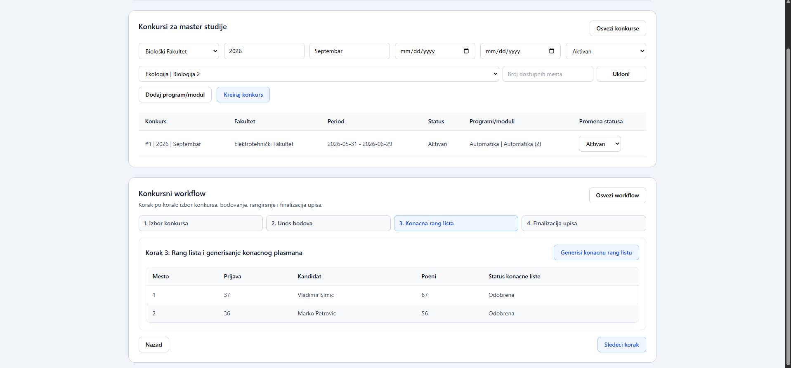

Final ranking lists overview:

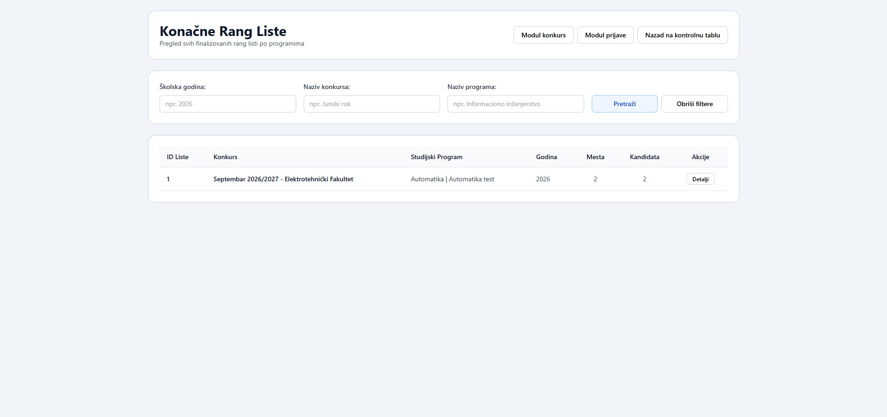

Ranking list details:

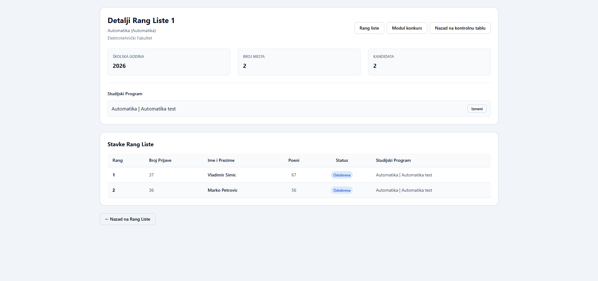

### 5. Enrollment Finalization (Student View)

Finalized enrollment status and contract download:

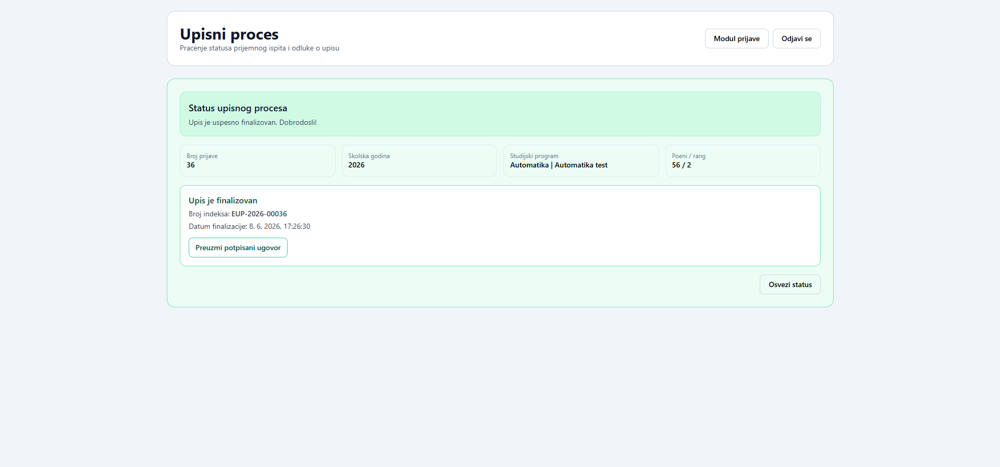

## Tech Stack

### Backend

- **Node.js + TypeScript**
- **Express** (REST API)
- **Oracle Database** via `oracledb`
- JWT authentication (`jsonwebtoken`)
- File upload support (`multer`)

### Frontend

- **React + TypeScript**
- **Vite** for development/build tooling
- **Redux Toolkit** for state management
- **React Router** for route-level role separation
- **Tailwind CSS** for UI styling
- **Axios** for API communication

## Architecture Overview

### Backend modules

- `auth`
- `kandidati`
- `prijave`
- `konkurs`
- `upis`
- `rankingLists`

### Main API groups

- `/api/auth`
- `/api/kandidati`
- `/api/prijave`
- `/api/konkursi`
- `/api/upis`
- `/api/ranking-lists`

### Frontend feature modules

- `auth`
- `dashboard`
- `kandidati`
- `prijave`
- `konkurs`
- `upis`
- `rankingLists`

## Repository Structure

```text
.
├─ backend/
│  ├─ sql/migrations/
│  ├─ src/
│  │  ├─ modules/
│  │  ├─ middleware/
│  │  ├─ db/
│  │  └─ ...
│  └─ package.json
├─ frontend/
│  ├─ src/
│  │  ├─ app/
│  │  ├─ features/
│  │  ├─ services/
│  │  ├─ redux/
│  │  └─ ...
│  └─ package.json
└─ README.md
```

## Prerequisites

- Node.js 18+
- npm 9+
- Oracle database access (user/schema with required objects)

## Environment Configuration

### Backend (`backend/.env`)

Start from `backend/.env.example` and provide real values:

```env
NODE_ENV=development
PORT=4000

JWT_SECRET=replace-with-secure-secret
JWT_EXPIRES_IN=8h

ORACLE_USER=your_oracle_user
ORACLE_PASSWORD=your_oracle_password
ORACLE_CONNECT_STRING=localhost:1521/orcl
ORACLE_POOL_MIN=1
ORACLE_POOL_MAX=4
ORACLE_POOL_INCREMENT=1
```

Notes:

- `JWT_SECRET`, `ORACLE_USER`, `ORACLE_PASSWORD`, and `ORACLE_CONNECT_STRING` are required.
- Example admin/student credentials in `.env.example` are development-oriented defaults.

### Frontend (`frontend/.env`)

Optional (defaults are already provided in code):

```env
VITE_API_BASE_URL=http://localhost:4000/api
```

## Local Development

### 1. Install dependencies

Backend:

```bash
cd backend
npm install
```

Frontend:

```bash
cd frontend
npm install
```

### 2. Run backend

```bash
cd backend
npm run dev
```

Backend starts on `http://localhost:4000` by default.

### 3. Run frontend

```bash
cd frontend
npm run dev
```

Frontend starts on Vite default port (usually `http://localhost:5173`).

## Build Commands

Backend:

```bash
cd backend
npm run build
```

Frontend:

```bash
cd frontend
npm run build
```

## Quality and Operational Notes

- The project uses layered backend modules (controller/service/repository) for clear responsibilities.
- Error handling is centralized through API error wrappers and middleware.
- Authentication is JWT-based with role checks (`admin`, `student`).
- The codebase currently relies primarily on build-time checks (`tsc`, frontend lint/build).

## Suggested Next Improvements

- Add automated integration tests for critical flows (application creation, ranking generation, finalization).
- Add CI pipeline (build + lint + test).
- Add seeded demo dataset for easier reviewer onboarding.
- Add API docs (OpenAPI/Swagger) for public endpoint contracts.

## License

This repository currently does not define a root project license. Add one if needed for distribution or public release.
